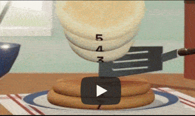

<!-- ═══════════════ HEADER ═══════════════ -->
<div align="center">



<a href="https://github.com/Avleen2002">
  
</a>

<br/>


</div>

<br/>

<!-- ═══════════════ ABOUT ═══════════════ -->
## `> whoami`

```python
class Me:
    name       = "Avleen Kaur Virdi"
    role       = "Software Developer"
    education  = "Computer Science Graduate"
    obsessions = ["Algorithms", "Data Structures", "Creative Coding", "Data Science"]
    superpower = "Making technology feel a little more like art"
    currently  = "Building a Workplace burnout detection model"
    companions = ["a very observant black cat", "one small, unbothered bird"]

    def say_hi(self):
        return "Let's build something awesome together ✨"
```

<br/>

<!-- ═══════════════ TECH STACK ═══════════════ -->
## `> ls ./skills`

<div align="center">

| | |
|:--|:--|
| **💻 Languages** |          <br/>  |
| **🧠 AI & Data Science** |      <br/>             |
| **🌐 Web Development** |      <br/>    |
| **📱 Mobile & Desktop Apps** |      <br/>    |
| **⚙️ Systems & Low-Level** |    <br/>          |
| **🗄️ Databases** |  <br/>     |
| **🔐 Networking & Security** |   <br/>           |
| **🎨 Design & UX** | <br/>     |
| **🧰 Tools I Use** |        <br/>   |

</div>

<br/>

<!-- ═══════════════ SOFT SKILLS ═══════════════ -->
## `> cat ./soft_skills.txt`

<div align="center">

| | | |
|:---:|:---:|:---:|
| 🧩 **Problem Solving**<br/><sub>Took a model from 63% to 97% accuracy through iteration</sub> | 🎨 **Creativity**<br/><sub>Recognized for "Most Creative App" and a hackathon win</sub> | 🤝 **Collaboration**<br/><sub>Shipped projects in teams, from hackathons to medical software</sub> |
| 💬 **Communication**<br/><sub>Turns complex data into clear, actionable insight</sub> | 🌱 **Adaptability**<br/><sub>Picks up new languages and platforms fast: JS, Kotlin, Chrome APIs</sub> | ⏱️ **Time Management**<br/><sub>Delivered a full app in a month under a strict timeline</sub> |
| 💛 **Empathy**<br/><sub>Designs for real people, from dementia care to hand disabilities</sub> | 🧭 **Ownership**<br/><sub>Maintained and tested a project for 4 months after launch</sub> | 🔍 **Curiosity**<br/><sub>Always asking why, then going back to measure it properly</sub> |

</div>

<br/>

<!-- ═══════════════ FEATURED WORK ═══════════════ -->
## `> git log --highlights`

<div align="center">

| Project | Highlights | Built with |
|:--|:--|:--|
| **YASE**<br/><sub>Multi-threaded storage engine</sub> | Row-store database engine from scratch: direct I/O pages, LRU buffer manager, two-phase locking, write-ahead logging, concurrent skip-list index. **7,000+ commits/sec** on 4 threads, zero leaks under Valgrind | `C++17` |
| **Onion Routing Network**<br/><sub>Encrypted overlay network</sub> | 4-node onion network where no single relay sees both endpoints. Measured a fixed 24-byte encryption overhead per message across a 3-hop circuit | `Python` `Scapy` `AES-256` `Diffie-Hellman` |
| **Voyager**<br/><sub>Reliable transport protocol over UDP</sub> | TCP-inspired protocol with 3-way handshake, sliding window, congestion control and checksums. Reliable transfer of **50 MB files** under packet loss and reordering | `Python` `UDP` |
| **Workplace Burnout Detection**<br/><sub>Data mining pipeline</sub> | End-to-end ML pipeline on 4,000+ samples with SMOTE, PCA and LASSO. **97.4% accuracy, 99.89% AUC-ROC** | `scikit-learn` `pandas` `NumPy` |
| **Escape the Madness**<br/><sub>Web escape room game</sub> | Real-time puzzle game with a stress-based decision system. **🏆 1st place at Mountain Madness 2025** | `React` `TypeScript` `CSS` |
| **BinIt!**<br/><sub>Recycling helper</sub> | Waste sorting website that uses an image recognition model to promote recycling. **WiCS Award at Root Hacks** | `Python` `JavaScript` `TensorFlow` |
| **Sign Language for Numbers**<br/><sub>Image classifier</sub> | Detects number signs in images, improved from 63% to **97% test accuracy** | `Python` |
| **Anomaly Detection System**<br/><sub>Household power data</sub> | PCA capturing 97% variance, then an HMM with a tuned anomaly threshold | `R` |

</div>

<br/>

<!-- ═══════════════ ACHIEVEMENTS ═══════════════ -->
## `> cat ./achievements.md`

- 🏆 **1st Place**, Mountain Madness 2025 (*Escape the Madness*)
- 🌸 **WiCS Award**, Root Hacks hackathon at SFU (*BinIt!*)
- 🥈 **Runner-up**, Deloitte ThinkTECH 2023 (*Bus Frequency Map*)
- 🎨 **MIT "Most Creative App of the Month"**, June 2020 (*Masker Aid*)

<br/>

<!-- ═══════════════ STATS ═══════════════ -->
## `> cat ./stats.json`

<div align="center">


<br/>


</div>

<br/>

<!-- ═══════════════ ACTIVITY GRAPH ═══════════════ -->
## `> tail -f ./activity.log`

<div align="center">

</div>

<br/>

<!-- ═══════════════ SNAKE ═══════════════ -->
## `> ./snake --eat-contributions`

<div align="center">
<picture>
  <source media="(prefers-color-scheme: dark)" srcset="https://raw.githubusercontent.com/Avleen2002/Avleen2002/output/github-snake-dark.svg" />
  
</picture>
</div>

<br/>

<!-- ═══════════════ FEATURED REPOS ═══════════════ -->
## `> git log --pinned`

<div align="center">

<a href="https://github.com/Avleen2002/BinIt">
  
</a>
<a href="https://github.com/Avleen2002/Anomaly-Detection-with-HMM-in-R">
  
</a>
<a href="https://github.com/Avleen2002/Port-Scanner">
  
</a>
<a href="https://github.com/Avleen2002/myShell-C">
  
</a>

</div>

<br/>

<!-- ═══════════════ ALGORITHM CORNER ═══════════════ -->
## `> cat ./algorithm_corner.md`

<details>
<summary><b>🥞 Click to expand: my favorite algorithm of the week (pancake sort)</b></summary>

<br/>

```c
void pancakeSort(int* arr, int n) {
    int maxdex;
    while (n > 1) {
        maxdex = maxIndex(arr, n);
        if (maxdex != n) {
            flip(arr, maxdex);
            flip(arr, n-1);
        }
        n--;
    }
}
```

<div align="center">
  
</div>

</details>

<br/>

<!-- ═══════════════ CONNECT ═══════════════ -->
## `> ./connect --all`

<div align="center">

<a href="https://www.linkedin.com/in/avleen-kaur-virdi/">
  
</a>
<a href="https://www.instagram.com/alicevirdi2002/">
  
</a>
<a href="mailto:alicevirdi2002@gmail.com">
  
</a>

</div>

<br/>

<!-- ═══════════════ FOOTER ═══════════════ -->
<div align="center">


</div>
